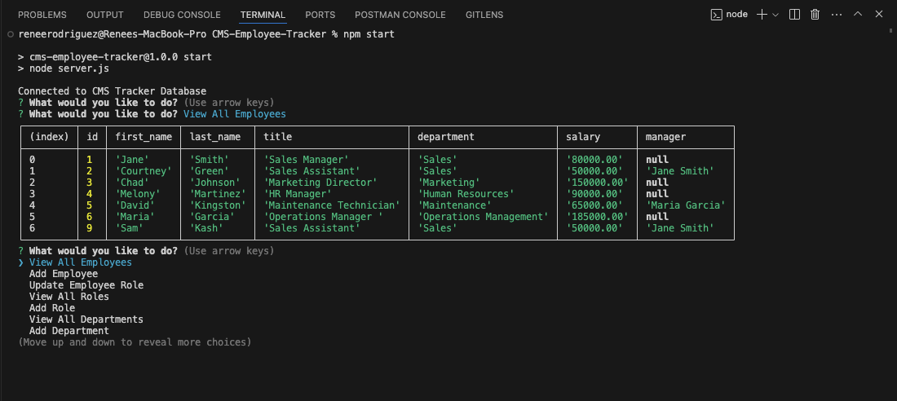

# CMS Employee Tracker

  ## Description
  CMS Employee Tracker is a command-line application to manage a company's employee database, using Node.js, Inquirer, and PostgreSQL.
  
  
 
  ## Installation
  Clone repo and run `npm install`.

  ## Usage
  To run the application, execute the command `npm start`.

  ## Deployed Application URL
  [Walkthrough Video](./assets/CMS_Employee_Tracker.mov)

  ## Screenshot
  

  ## Features
  Creates and displays employees, roles, and departments along with updating employee roles.

  ## License
    Licensed under the MIT license.